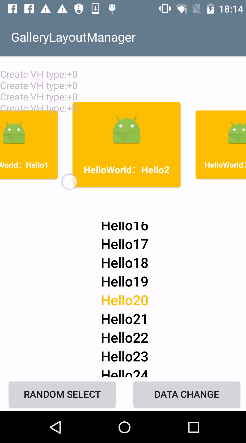

# GalleryLayoutManager

[English](./README.md)

使用自定义 `LayoutManager` 实现 Android 中 `Gallery` 或者 `ViewPager` 控件的效果，支持垂直和水平两个方向，支持 `RecycleView` 的试图回收机制

## 效果




## 使用方法

### 1、添加依赖

#### Gradle

```java
compile 'github.hellocsl:GalleryLayoutManager:1.0.3'
```

> 注意：如果你的项目已经引用了 `RecyclerView` ，那么应该这样引用，而且你的 `RecyclerView` 的引用版本必须大于 24.2.0

```java
compile ('github.hellocsl:GalleryLayoutManager:1.0.3'){
    exclude group: 'com.android.support', module:'recyclerview-v7'
}
```

### 2、代码

#### 基本使用

不要使用 `RecycleView#setLayoutManager` 方法，而是使用 `GalleryLayoutManager#attach` 方法来绑定`RecycleView` 和 `GalleryLayoutManager`

```java
GalleryLayoutManager layoutManager = new GalleryLayoutManager(GalleryLayoutManager.HORIZONTAL);
//layoutManager.attach(mPagerRecycleView);  默认选中位置为0
//不要使用 RecycleView#setLayoutManager 方法，而是使用 GalleryLayoutManager#attach 方法
layoutManager.attach(mPagerRecycleView, 30);

//...
//为 RecycleView 绑定 adapter
mPagerRecycleView.setAdapter(imageAdapter);
```

#### 监听 Item 选中

```java
//添加视图选中监听
layoutManager.setOnItemSelectedListener(new GalleryLayoutManager.OnItemSelectedListener() {
    @Override
    public void onItemSelected(RecyclerView recyclerView, View item, int position) {
        //.....
    }
});
```

#### 和 ViewPager 一样添加Item转换器

继承实现 `GalleryLayoutManager.ItemTransformer`

```java
public class ScaleTransformer implements GalleryLayoutManager.ItemTransformer {

    @Override
    public void transformItem(GalleryLayoutManager layoutManager, View item, float fraction) {
        item.setPivotX(item.getWidth() / 2.f);
        item.setPivotY(item.getHeight()/2.0f);
        float scale = 1 - 0.3f * Math.abs(fraction);
        item.setScaleX(scale);
        item.setScaleY(scale);
    }
}
```

```java
//添加 Item 转换器，和 ViewPager 一样使用
layoutManager.setItemTransformer(new ScaleTransformer());
```

## License

```
Copyright [2017] [Hello Csl]

Licensed under the Apache License, Version 2.0 (the "License"); you may not use this file except in compliance with the License. You may obtain a copy of the License at

<http://www.apache.org/licenses/LICENSE-2.0>

Unless required by applicable law or agreed to in writing, software distributed under the License is distributed on an "AS IS" BASIS, WITHOUT WARRANTIES OR CONDITIONS OF ANY KIND, either express or implied. See the License for the specific language governing permissions and limitations under the License.
```
